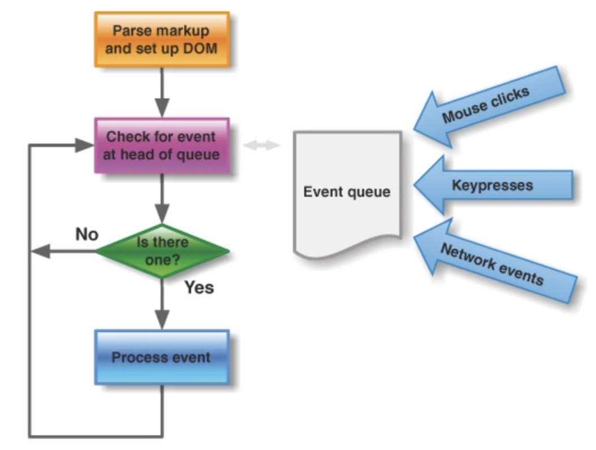

# Vue实现双向绑定的原理

### 基于数据劫持的优势

1. 无需显示调用。例如Vue运用数据劫持+发布订阅，在数据变动时发布消息给订阅者，触发相应的监听回调驱动视图更新。
2. 可精确得知变化数据。例如劫持属性的setter，当属性改变可以得到变化的内容，不需要做额外的diff操作。


### 实现思路

1. 通过Object.defineProperty生成监听器Observer监听对象属性，在属性发生变化后通知订阅者。
2. 通过Compile解析编译模版指令，根据指令模版替换数据，绑定相应的更新函数。
3. 通过Watcher衔接Observer和Compile，订阅并收到每个属性变化的通知，执行指令绑定的回调函数更新视图。

每个组件实例都对应一个watcher实例，它会在组件渲染过程中把接触过的数据property记录为依赖。之后当依赖项的setter触发时，会通知watcher，从而使它关联的组件重新渲染。


### Observer

#### observe

observe是用来监听数据变化的。

observe方法作用是给非VNode的对象类型数据添加一个Observer，如果已经添加过则直接返回，否则在满足一定条件下去实例化一个Observer对象实例。

observe源码：
```javascript
/**
 * Attempt to create an observer instance for a value,
 * returns the new observer if successfully observed,
 * or the existing observer if the value already has one.
 */
function observe (value, asRootData) {
  if (!isObject(value) || value instanceof VNode) {
    return
  }
  var ob;
  if (hasOwn(value, '__ob__') && value.__ob__ instanceof Observer) {
    ob = value.__ob__;
  } else if (
    shouldObserve &&
    !isServerRendering() &&
    (Array.isArray(value) || isPlainObject(value)) &&
    Object.isExtensible(value) &&
    !value._isVue
  ) {
    ob = new Observer(value);
  }
  if (asRootData && ob) {
    ob.vmCount++;
  }
  return ob
}
```

#### Observer

Observer作用是给对象属性添加getter和setter，用于依赖收集和派发更新。

Observer的构造函数逻辑：
1. 首先实例化Dep对象。
2. 接着通过执行def函数把自身实例添加到数据对象value的__ob__属性上。def函数是一个非常简单的Object.defineProperty封装。
3. 对value做判断，对于数组会调用observeArray方法，纯对象则调用walk方法。
    1. observeArray是遍历数组再次调用observe方法。
    2. walk是遍历对象的key调用defineReactive方法。

def源码：
```javascript
/**
 * Define a property.
 */
function def (obj, key, val, enumerable) {
  Object.defineProperty(obj, key, {
    value: val,
    enumerable: !!enumerable,
    writable: true,
    configurable: true
  });
}
```

Observer源码：
```javascript
/**
 * Observer class that is attached to each observed
 * object. Once attached, the observer converts the target
 * object's property keys into getter/setters that
 * collect dependencies and dispatch updates.
 */
var Observer = function Observer (value) {
  this.value = value;
  this.dep = new Dep();
  this.vmCount = 0;
  def(value, '__ob__', this);
  if (Array.isArray(value)) {
    if (hasProto) {
      protoAugment(value, arrayMethods);
    } else {
      copyAugment(value, arrayMethods, arrayKeys);
    }
    this.observeArray(value);
  } else {
    this.walk(value);
  }
};

/**
 * Walk through all properties and convert them into
 * getter/setters. This method should only be called when
 * value type is Object.
 */
Observer.prototype.walk = function walk (obj) {
  var keys = Object.keys(obj);
  for (var i = 0; i < keys.length; i++) {
    defineReactive$$1(obj, keys[i]);
  }
};

/**
 * Observe a list of Array items.
 */
Observer.prototype.observeArray = function observeArray (items) {
  for (var i = 0, l = items.length; i < l; i++) {
    observe(items[i]);
  }
};
```

#### defineReactive

defineReactive的作用是定义一个响应式对象，给对象添加getter和setter。

1. 初始化Dep对象的实例。
2. 拿到obj的属性描述符，然后对子对象递归调用observe方法，保证了子属性也能够变成响应式对象。
3. 最后利用Object.defineProperty给obj的属性添加getter和setter。

源码：
```javascript
/**
 * Define a reactive property on an Object.
 */
function defineReactive$$1 (
  obj,
  key,
  val,
  customSetter,
  shallow
) {
  var dep = new Dep();

  var property = Object.getOwnPropertyDescriptor(obj, key);
  if (property && property.configurable === false) {
    return
  }

  // cater for pre-defined getter/setters
  var getter = property && property.get;
  var setter = property && property.set;
  if ((!getter || setter) && arguments.length === 2) {
    val = obj[key];
  }

  var childOb = !shallow && observe(val);
  Object.defineProperty(obj, key, {
    enumerable: true,
    configurable: true,
    get: function reactiveGetter () {
      var value = getter ? getter.call(obj) : val;
      if (Dep.target) {
        dep.depend();
        if (childOb) {
          childOb.dep.depend();
          if (Array.isArray(value)) {
            dependArray(value);
          }
        }
      }
      return value
    },
    set: function reactiveSetter (newVal) {
      var value = getter ? getter.call(obj) : val;
      /* eslint-disable no-self-compare */
      if (newVal === value || (newVal !== newVal && value !== value)) {
        return
      }
      /* eslint-enable no-self-compare */
      if (customSetter) {
        customSetter();
      }
      // #7981: for accessor properties without setter
      if (getter && !setter) { return }
      if (setter) {
        setter.call(obj, newVal);
      } else {
        val = newVal;
      }
      childOb = !shallow && observe(newVal);
      dep.notify();
    }
  });
}
```


监听到变化后通知订阅者（watcher）。需要实现一个消息订阅器（Dep）。维护一个数组，用来收集订阅者，数据变动触发notify，再调用订阅者的update方法。

Dep类定义了一些属性和方法，特别注意的是它有一个静态属性target，这是全局唯一Watcher，因为在同一时间只能有一个全局Watcher被计算，它的自身属性subs也是Wacther的数组。Dep实际上就是对Watcher的一种管理。

示例代码：


在getter中，向订阅器中添加订阅者（Watcher）。

示例代码：


### Compile

compile作用是解析模版指令，将模版中的变量替换成数据，然后初始化渲染页面视图，并将每个指令对应的节点绑定更新函数，添加监听数据的订阅者，一旦数据有变动，收到通知，更新视图。

1. 遍历所有节点及其子节点，扫描解析编译。
2. 调用对应的指令渲染函数进行数据渲染。
3. 调用对应的指令更新函数进行绑定，通过new Watcher()添加回调来接收数据变化的通知。

示例代码：



### Watcher

作用是实现Observer和Compile之前通信。

1. 在自身实例化时向属性订阅器（dep）添加自己。
2. 自身有一个update()方法。
3. 待属性变动dep.notify()通知时，调用自身update()方法，并触发Compile中绑定的回调。

示例代码：


源码：（依赖项更新时将被调用）
```javascript
/**
 * Subscriber interface.
 * Will be called when a dependency changes.
 */
Watcher.prototype.update = function update () {
  /* istanbul ignore else */
  if (this.lazy) {
    this.dirty = true;
  } else if (this.sync) {
    this.run();
  } else {
    queueWatcher(this);
  }
};
```
queueWatcher方法作用是将watcher（观察者）推送到观察者队列中。具有重复ID的作业将被跳过，除非在刷新队列时推送。（是优化点）

源码：
```javascript
/**
 * Push a watcher into the watcher queue.
 * Jobs with duplicate IDs will be skipped unless it's
 * pushed when the queue is being flushed.
 */
function queueWatcher (watcher) {
  var id = watcher.id;
  if (has[id] == null) {
    has[id] = true;
    if (!flushing) {
      queue.push(watcher);
    } else {
      // if already flushing, splice the watcher based on its id
      // if already past its id, it will be run next immediately.
      var i = queue.length - 1;
      while (i > index && queue[i].id > watcher.id) {
        i--;
      }
      queue.splice(i + 1, 0, watcher);
    }
    // queue the flush
    if (!waiting) {
      waiting = true;

      if (!config.async) {
        flushSchedulerQueue();
        return
      }
      nextTick(flushSchedulerQueue);
    }
  }
}
```

### Virtual DOM（虚拟DOM）

Vue通过vm._render方法（最终是通过执行createElement方法返回vnode）把实例渲染成一个虚拟Node。

Virtual DOM是使用js对象描述DOM节点。

源码：
```javascript
var VNode = function VNode (
  tag,
  data,
  children,
  text,
  elm,
  context,
  componentOptions,
  asyncFactory
) {
  this.tag = tag;
  this.data = data;
  this.children = children;
  this.text = text;
  this.elm = elm;
  this.ns = undefined;
  this.context = context;
  this.fnContext = undefined;
  this.fnOptions = undefined;
  this.fnScopeId = undefined;
  this.key = data && data.key;
  this.componentOptions = componentOptions;
  this.componentInstance = undefined;
  this.parent = undefined;
  this.raw = false;
  this.isStatic = false;
  this.isRootInsert = true;
  this.isComment = false;
  this.isCloned = false;
  this.isOnce = false;
  this.asyncFactory = asyncFactory;
  this.asyncMeta = undefined;
  this.isAsyncPlaceholder = false;
};
```

VNode是对真实DOM的一种抽象描述，核心的关键属性有标签名，数据，子节点，键值等。由于VNode只是用来映射到真实DOM的渲染，不包含操作DOM的方法，因此非常轻量和简单。

映射到真实的DOM要经历VNode的create、diff、patch等过程。Vue利用createElement方法创建的VNode。

源码：
```javascript
function createElement (
  context,
  tag,
  data,
  children,
  normalizationType,
  alwaysNormalize
) {
  if (Array.isArray(data) || isPrimitive(data)) {
    normalizationType = children;
    children = data;
    data = undefined;
  }
  if (isTrue(alwaysNormalize)) {
    normalizationType = ALWAYS_NORMALIZE;
  }
  return _createElement(context, tag, data, children, normalizationType)
}
```

每个VNode有children，children每个元素也是一个VNode，这样就形成了一个VNode Tree，它很好的描述了我们的DOM Tree。

通过vm._update把VNode渲染成真实DOM。它被调用的时机有2个，一个是首次渲染，一个是数据更新的时候。_update的核心方法是`vm.__patch__`。

从初始化Vue到最终渲染的整个过程，参考下图：


> 参考资料：https://ustbhuangyi.github.io/vue-analysis/v2/prepare/
