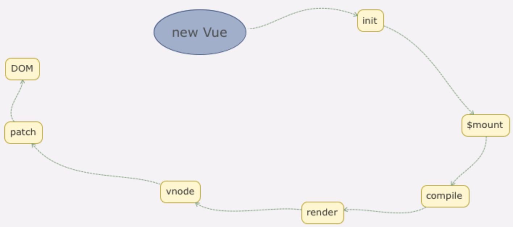

# VNode

Vue通过vm._render方法（最终是通过执行createElement方法返回vnode）把实例渲染成一个虚拟Node。

Virtual DOM是使用js对象描述DOM节点。

源码：
```javascript
export default class VNode {
  tag: string | void;
  data: VNodeData | void;
  children: ?Array<VNode>;
  text: string | void;
  elm: Node | void;
  ns: string | void;
  context: Component | void; // rendered in this component's scope
  key: string | number | void;
  componentOptions: VNodeComponentOptions | void;
  componentInstance: Component | void; // component instance
  parent: VNode | void; // component placeholder node

  // strictly internal
  raw: boolean; // contains raw HTML? (server only)
  isStatic: boolean; // hoisted static node
  isRootInsert: boolean; // necessary for enter transition check
  isComment: boolean; // empty comment placeholder?
  isCloned: boolean; // is a cloned node?
  isOnce: boolean; // is a v-once node?
  asyncFactory: Function | void; // async component factory function
  asyncMeta: Object | void;
  isAsyncPlaceholder: boolean;
  ssrContext: Object | void;
  fnContext: Component | void; // real context vm for functional nodes
  fnOptions: ?ComponentOptions; // for SSR caching
  devtoolsMeta: ?Object; // used to store functional render context for devtools
  fnScopeId: ?string; // functional scope id support

  constructor (
    tag?: string,
    data?: VNodeData,
    children?: ?Array<VNode>,
    text?: string,
    elm?: Node,
    context?: Component,
    componentOptions?: VNodeComponentOptions,
    asyncFactory?: Function
  ) {
    this.tag = tag
    this.data = data
    this.children = children
    this.text = text
    this.elm = elm
    this.ns = undefined
    this.context = context
    this.fnContext = undefined
    this.fnOptions = undefined
    this.fnScopeId = undefined
    this.key = data && data.key
    this.componentOptions = componentOptions
    this.componentInstance = undefined
    this.parent = undefined
    this.raw = false
    this.isStatic = false
    this.isRootInsert = true
    this.isComment = false
    this.isCloned = false
    this.isOnce = false
    this.asyncFactory = asyncFactory
    this.asyncMeta = undefined
    this.isAsyncPlaceholder = false
  }

  // DEPRECATED: alias for componentInstance for backwards compat.
  /* istanbul ignore next */
  get child (): Component | void {
    return this.componentInstance
  }
}
```

VNode是对真实DOM的一种抽象描述，核心的关键属性有标签名，数据，子节点，键值等。由于VNode只是用来映射到真实DOM的渲染，不包含操作DOM的方法，因此非常轻量和简单。

映射到真实的DOM要经历VNode的create、diff、patch等过程。Vue利用createElement方法创建的VNode。

源码：

```javascript
export function createElement (
  context: Component,
  tag: any,
  data: any,
  children: any,
  normalizationType: any,
  alwaysNormalize: boolean
): VNode | Array<VNode> {
  if (Array.isArray(data) || isPrimitive(data)) {
    normalizationType = children
    children = data
    data = undefined
  }
  if (isTrue(alwaysNormalize)) {
    normalizationType = ALWAYS_NORMALIZE
  }
  return _createElement(context, tag, data, children, normalizationType)
}
```

每个VNode有children，children每个元素也是一个VNode，这样就形成了一个VNode Tree，它很好的描述了我们的DOM Tree。

通过vm._update把VNode渲染成真实DOM。它被调用的时机有2个，一个是首次渲染，一个是数据更新的时候。_update的核心方法是`vm.__patch__`。

从初始化Vue到最终渲染的整个过程，参考下图：


